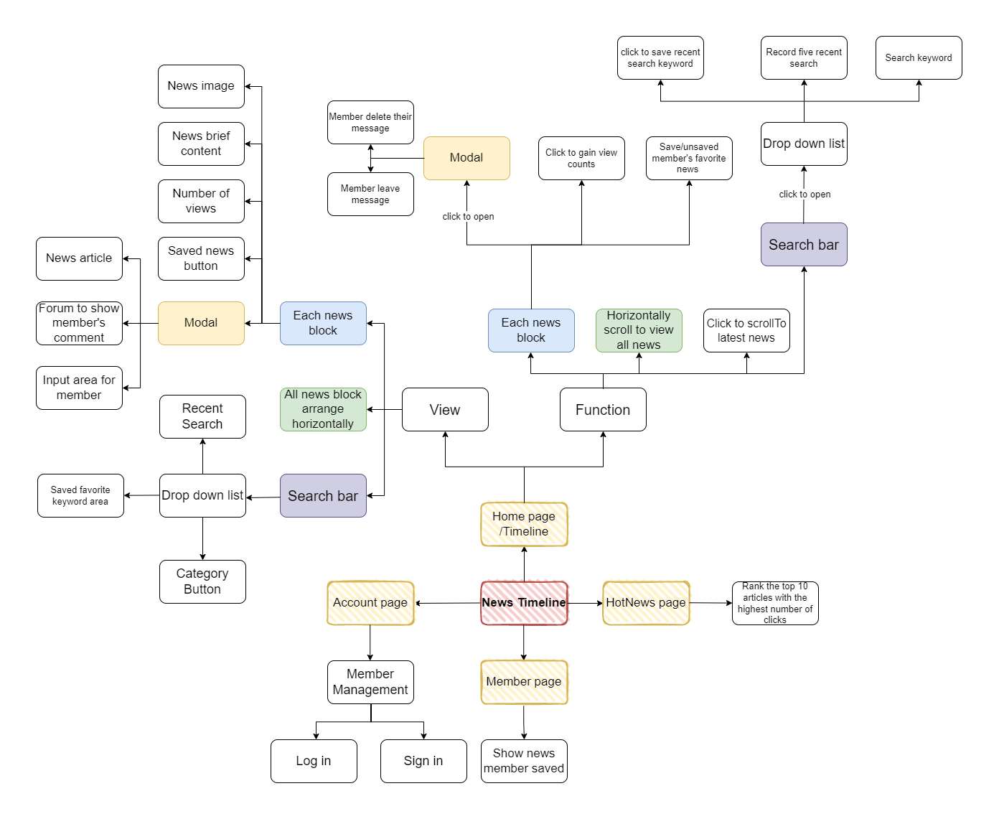
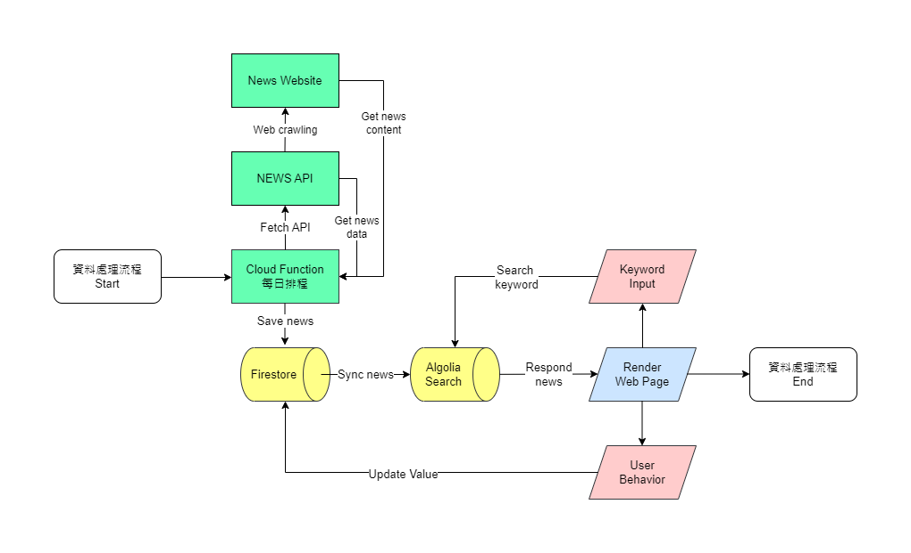
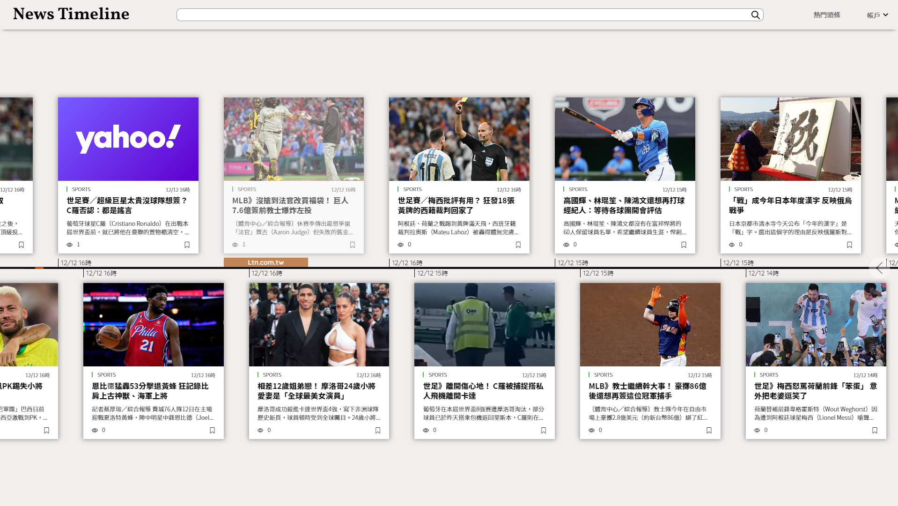
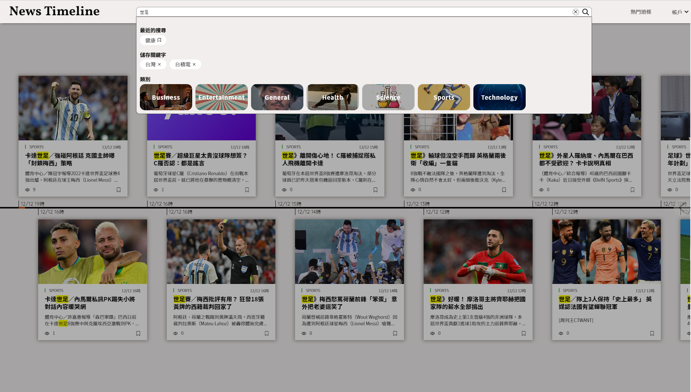
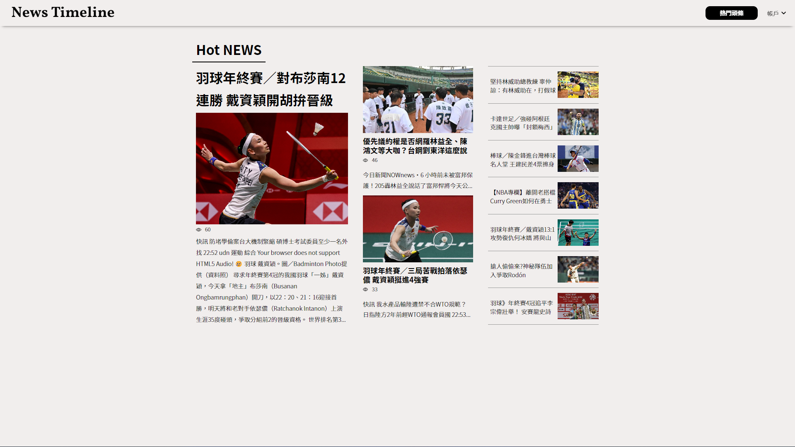

# News Timeline
[URL](https://newstimeline-62758.web.app/)

#### Test Account : mario@gmail.com
#### Test password : 1111111
#### Test DisplayName : mario

## Description
By displaying news on a horizontal timeline, this website tries to faithfully present the development
of news events, readers who visit this website are allowed to keep track of news development by
time at a glance.

## Technique

### Fundamentals
- HTML
- CSS
- JavaScript(ES6+)
- TypeScript
- Node.js

### Libraries
- React
- React Router
- Styled-Components
- Create React App
- Lodash Debounce

### Firebase
- Firestore
- Hosting
- Cloud Functions
- Authentication

### Networking
- HTTP / HTTPS
- AJAX

### Others
- ESLint

## Function Map

  

## Flow Chart

  

## 功能展示
- Implemented a horizontal infinite scroll to load news.

  

- Scheduled a cloud function to fetch News API and web crawling news content everyday.
- Implemented web crawling by Node.js and Readability.

- Enabled news articles’ full text search of the website with Algolia search engine.
- Categorized news and can send search requests based on each category.
- Fulfilled the function to remember user’s five recent search keywords in search bar.
- Provided a saved keywords feature for member to save their favorite keywords.
- Optimized search performance by using the debounce function.

  

- Monitored the total number of clicks of each news to rank popular news in Hot News page.

  

- Provided a saved news feature for member to store their favorite news.

- Implemented member management by using Firebase Authentication.
- Built SPA website by react, create-react-app, and react-router.
- Used Styled-Components to build UI and RWD of the website.
