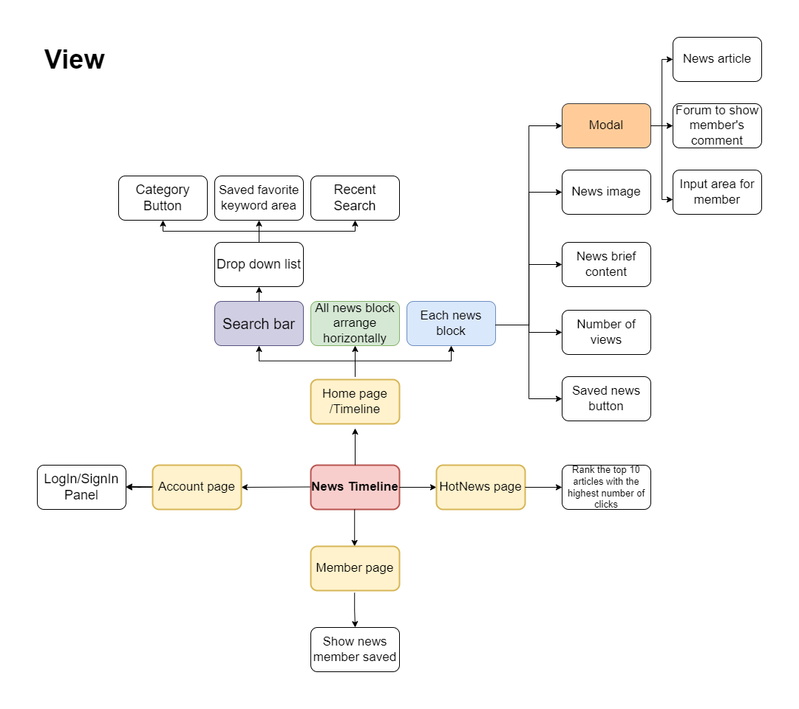
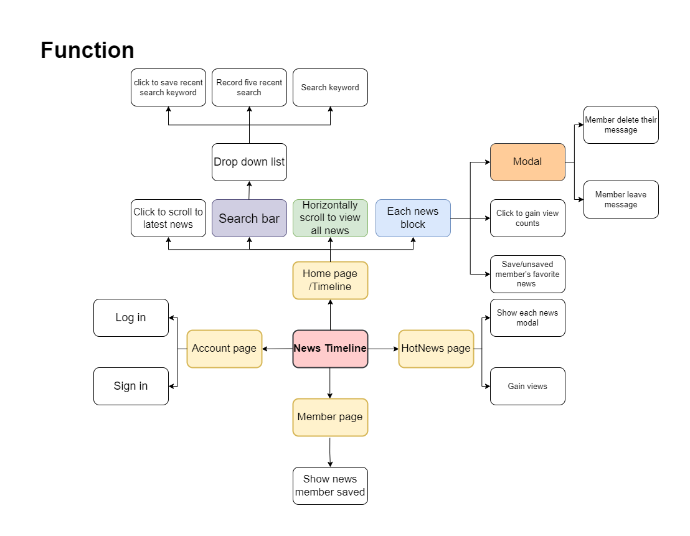
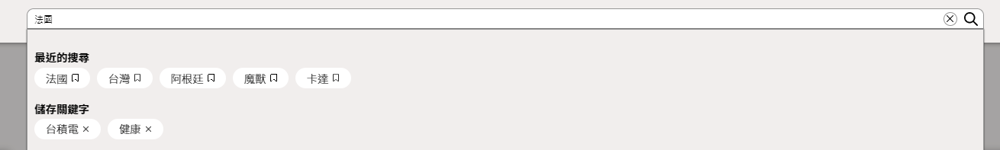
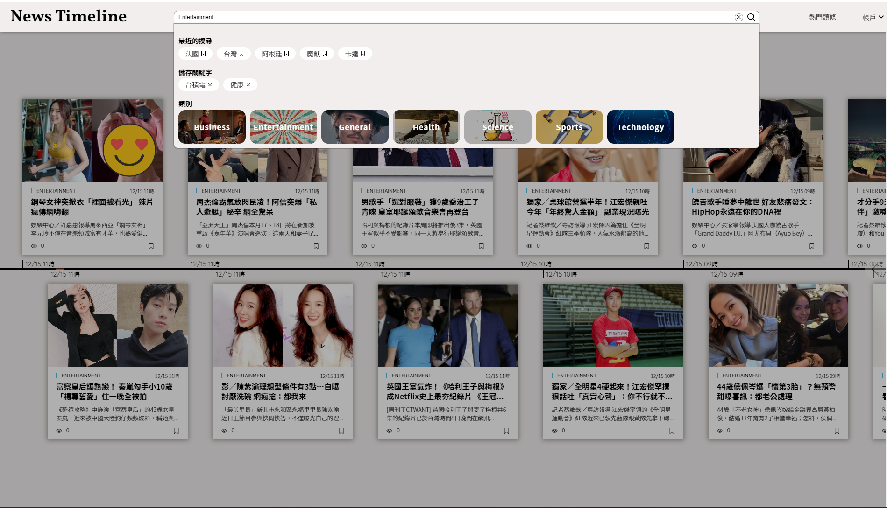
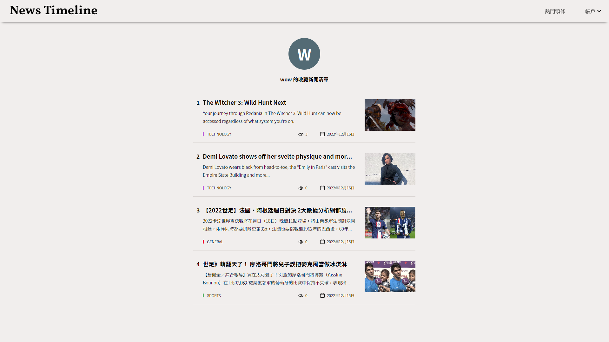
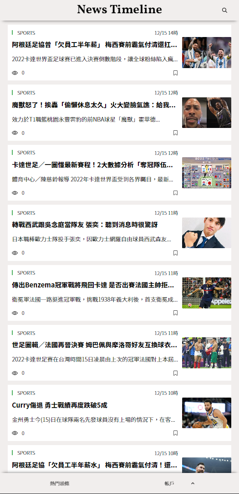
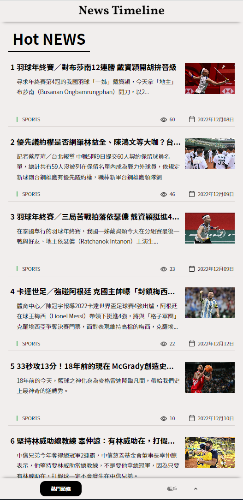
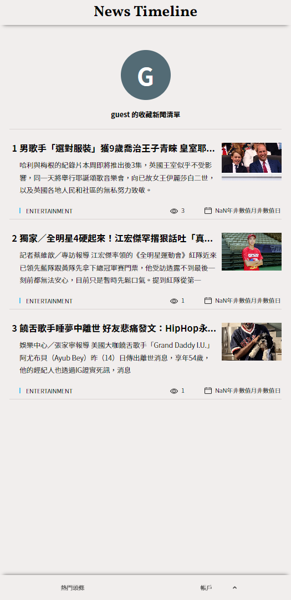

# News Timeline
[Website URL](https://newstimeline-62758.web.app/)

#### Test Account : guest@test.com
#### Test password : 1111111
#### Test DisplayName : guest

## Description
By displaying news on a horizontal timeline, this website tries to faithfully present the development
of news events, readers who visit this website are allowed to keep track of news development by
time at a glance.

### News Source API
Mainly from [News API](https://newsapi.org/)
But now I'm planing to change to [newscatcherapi](https://docs.newscatcherapi.com/api-docs/endpoints/latest-headlines)

## Technique

### Fundamentals
- HTML
- CSS
- JavaScript (ES6+)
- TypeScript
- Node.js

### Libraries
- React
- React Router
- Styled-Components
- Create React App
- Lodash Debounce

### Cloud Service 
- Firestore
- Hosting
- Cloud Functions
- Authentication
- Algolia

### Others
- ESLint

## Function Map

  

  

## Flow Chart

  

## 功能展示
- Implemented a horizontal infinite scroll to load news.

  

- Fulfilled the function to remember user’s five recent search keywords in search bar.
- Provided a saved keywords feature for member to save their favorite keywords.

  

- Categorized news and can send search requests based on each category.

  

- Monitored the total number of clicks of each news to rank popular news in Hot News page.

  

- Provided a saved news feature for member to store their favorite news.

  

- Used Styled-Components to build UI and RWD of the website.

&nbsp;&nbsp;&nbsp;&nbsp;

